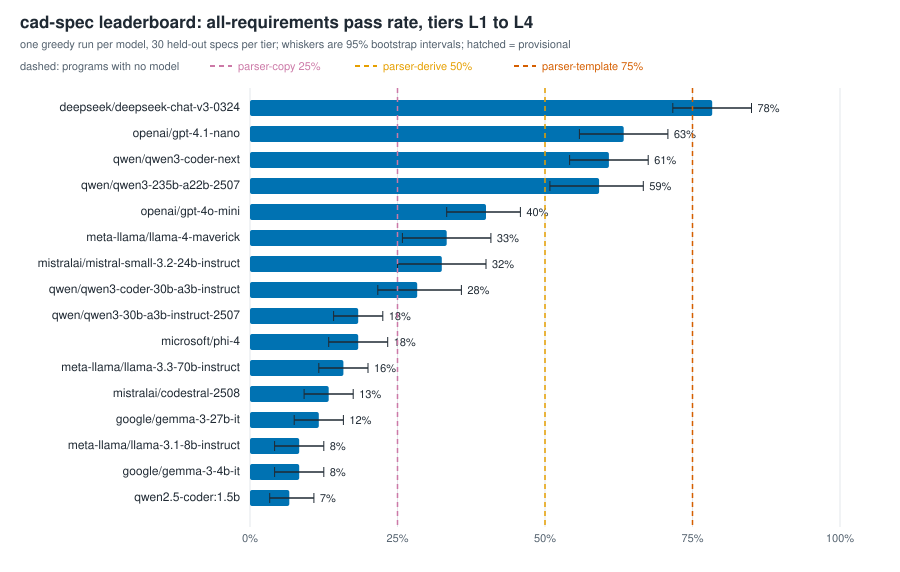

# cad-spec

[](https://github.com/azzbilal/cad-spec/actions/workflows/ci.yml)
[](LICENSE)

**An open, inspection-style RL reward environment for dimensioned parametric parts.**

A model reads a mechanical specification and writes CadQuery. The code is
executed in a sandbox, the resulting solid is measured from its exact
boundary representation, and each written requirement is checked against the
measurement the way an inspection report checks a machined part. The reward
is the fraction of requirements met, behind gates that zero known cheats.

What this is, and what it is not:

| Claim | Status |
|---|---|
| Scores a CadQuery part against 9 measurable requirements with partial credit | yes, one part family (4-hole mounting plate) |
| Measures the real geometry, not what the model's objects claim | yes since 0.4.0: model code hands over BREP geometry; a trusted process measures it ([SECURITY.md](SECURITY.md)) |
| Scorer validated against labelled mutants | yes: 1,230 mutants, 0 false full credit on 600 wrong parts, 0 false rejection on 600 correct parts ([results](results/scorer-validation-0.4.0.md)) |
| Separates "copying numbers" from "reading a spec" | partly: five prompt tiers, reported separately; L0 to L2 are solved by simple parsers, and L3 by a parser that knows its wording templates ([baselines](results/baselines-deterministic.md)) |
| Runs untrusted model code safely | per-rollout sandbox on POSIX, container for untrusted scale ([SECURITY.md](SECURITY.md)) |
| Ranks real models and shows *how* each one fails | yes: 16 models (15 hosted, 1 local), about $0.27 of API calls; failure labels checked by AI-assisted review of three fresh random samples: 28/30, 28/30, 27/30 ([leaderboard](#leaderboard)) |
| Separates knowledge failures from reasoning failures | yes: a pre-registered experiment ([below](#knowledge-or-reasoning-a-pre-registered-experiment)); a 7-line CadQuery cheat-sheet lifts four models by 42 to 56 points, while reasoning failures do not move |
| Shows that RL training improves a model | **not yet**: tooling is ready, no training run is published |
| Broad text-to-CAD benchmark, new part families | **no**: one family; see [ROADMAP.md](ROADMAP.md) |
| "Material" means alloy, strength, fit, manufacturability | **no**: R6 is volume consistency only |

## Quick start

**Scorer only** (needs nothing but CadQuery, from a plain checkout):

```bash
git clone https://github.com/azzbilal/cad-spec && cd cad-spec
pip install "cadquery==2.8.0"
python scripts/test_rubric.py              # 37 hand-labelled cases
```

**Full environment** (Verifiers, tests, validation):

```bash
cd environments/cad_spec
pip install -c constraints.txt -e ".[dev]"
pytest -q                                  # unit, sandbox, tier and harness tests
cd ../..
python scripts/validate_scorer.py          # mutation validation, ~90 s
```

On Windows use `py` instead of `python` outside a virtual environment.

**Score one answer from the command line:**

```bash
cad-spec prompt gen-0001 --tier L3 --split eval   # print a task
cad-spec score  gen-0001 answer.py                # PASS/FAIL per requirement
cad-spec sandbox                                  # what isolation applies here
```

## The task

Part family: a rectangular plate with a 4-hole bolt pattern, parameterised over
length, width, thickness, hole diameter and edge margin. A seeded sampler
(`tasks.py`, `SAMPLE_SEED = 20260813`) produces 200 train and 30 held-out
specs; the held-out set takes the 10 smallest plates, the 10 largest and 10
mid-range. That separates **parameters**, not part types.

The same specs are posed at five **tiers**. Geometry and scorer are identical
across tiers, so any score difference comes from how the requirement was
stated. Never average tiers together.

| Tier | Prompt | What it tests | Regex copier | Copier + one rule | Template-aware parser |
|---|---|---|---:|---:|---:|
| L0 | template with `???` slots | numeric copying | 100% | 100% | 100% |
| L1 | requirement table, no template | writing the CadQuery yourself | 100% | 100% | 100% |
| L2 | table without the hole pitch | deriving pitch = size - 2 x margin | 0% | 100% | 100% |
| L3 | prose; eval uses wordings never seen in train | robustness to unseen phrasing | 0% | 0% | **100%** |
| L4 | rev A model + engineering change order | a controlled edit | 0% | 0% | 0% |

The three right-hand columns are all-requirements pass rates of deterministic
programs with no model at all ([results](results/baselines-deterministic.md)).
L0 is kept only as a warm-up: a regex solves it.

**L3 caveat.** L3 has four train and two eval wording templates, and each
template states the numbers in a fixed order. A model that saw only the train
wordings cannot know the eval ones, so L3 does measure robustness to unseen
phrasing; but a parser given all six templates reads every eval prompt by
position and scores 100%. L3 is template-structured text, not free prose. A
larger, shuffled wording space is on the roadmap.

**L4 caveat.** Returning rev A unchanged earns a mean reward of 0.774 with 0%
full passes, because most requirements did not change. Partial credit is a
training signal; for L4 the headline metric is the all-requirements pass rate.
Every change order moves at least one value clearly outside its tolerance, so
an unedited model can never pass (checked on all 230 specs).

## Scoring

**Gates** zero the reward. Each exists because of a specific cheat, and each
cheat is a case in `scripts/test_rubric.py`:

| Gate | Cheat it kills |
|---|---|
| `single_solid` | loose pieces that share the bounding box (every shape on the Workplane stack is measured) |
| `clean_solid` | an enclosed cavity (a second shell), loose faces or edges beside the part, or an invalid B-rep: changes that keep the volume in band |
| `simple_through_holes` | blind dimples, counterbores, joggled two-sided holes, and membranes: each bore must be one diameter from the stock's bottom face to its top face, and a rod along its axis must meet no material |
| `hole_count_sane` | swiss-cheesing the plate to hit a volume target |
| `is_plate` | a shell or ellipse with the right bounding box (volume vs volume predicted from the measured geometry, 12% band) |

**Requirements** give partial credit, reward = k/9:

| Check | Tolerance | Referenced to |
|---|---|---|
| R1-R3 length, width, thickness | 0.5 mm | envelope size |
| R4a hole count | exact | closed bores |
| R4b hole diameter | 0.2 mm | each bore |
| R5 hole pattern | 0.5 mm | the **origin** (the prompt fixes the part centred on it) |
| R6 material | 3% | measured envelope minus nominal bores (volume only) |
| R7 edge margin | 0.5 mm | the part's own **edges** |
| R8 Z datum | 0.5 mm | plate mid-plane to **Z = 0** |

Tolerances are inclusive: 6.7 mm is inside 6.5 +/- 0.2 (comparisons carry a
1e-6 mm numerical slack; 0.3.x failed it on floating-point rounding).

Datums on purpose: a plate slid under its holes fails R7 only, a part moved
in X or Y fails R5 only, a part moved in Z fails R8 only. Before 0.3.0 only
sizes were checked, which are translation-invariant; before 0.4.0 Z was not
checked at all. Rotations are not normalised: the prompt fixes the axes.

Prompt numbering (R1-R6 in the task text) is the drawing's; check names are
the scorer's. The prompt's "R6 edge margin" is scored as `R7:edge_margin`;
`R6:material` has no line in the prompt because it is a consistency check.

At the environment level, code that builds a solid but satisfies nothing, or
fails a gate, earns a 0.05 floor so a weak model has a first rung. Code that
does not build a solid (including a bare 2D sketch) earns 0.

### How holes are found

Every Z-parallel cylindrical face is grouped by axis position and diameter.
Two independent tests decide whether a group is a drilled bore: a membership
probe just inside the surface rejects convex cylinders (rounds, bosses, shell
walls), and an area check rejects groups that do not close into a full
cylinder over the **union** of their faces' Z spans (corner fillets). Depth is
that union, so a bore split into stacked faces by a symmetric cutter is one
bore.

**Known limitation:** a hole that breaks out through a side wall does not
close, so it is reported in `Measurements.partial_bores` but not counted. The
part then loses count and pattern, where an inspector would say "4 holes, one
misplaced". Pinned as `LIMIT_hole_breakout`.

**Known limitation:** bores are recognised only as analytic cylinders. The
same correct part converted to NURBS surfaces (`toNURBS()`) scores 0. Models
do not produce this unprompted. Pinned as `LIMIT_nurbs_surfaces`.

## Leaderboard



One greedy, first-shot answer per spec (temperature 0, no CadQuery hints, no
retries), 30 held-out specs per tier. Score = all-requirements pass rate
averaged over L1 to L4, with a 95% bootstrap interval over specs. Full table,
tier heatmap and failure fingerprints:
[`results/leaderboard/leaderboard.md`](results/leaderboard/leaderboard.md).

| # | Model | Score [95% CI] | L1 | L2 | L3 | L4 |
|---:|---|---|---:|---:|---:|---:|
| 1 | deepseek-chat-v3-0324 | 78% [72, 85] | 97% | 93% | 63% | 60% |
| 2 | gpt-4.1-nano | 63% [56, 71] | 60% | 100% | 60% | 33% |
| 3 | qwen3-coder-next | 61% [54, 68] | 77% | 83% | 27% | 57% |
| 4 | qwen3-235b-a22b-2507 | 59% [51, 67] | 67% | 83% | 33% | 53% |
| 5 | gpt-4o-mini | 40% [33, 46] | 0% | 67% | 60% | 33% |
| 6 | llama-4-maverick | 33% [26, 41] | 7% | 3% | 70% | 53% |
| 7 | mistral-small-3.2-24b | 32% [25, 40] | 47% | 10% | 20% | 53% |
| 8 | qwen3-coder-30b-a3b | 28% [22, 36] | 7% | 40% | 13% | 53% |
| 9 | qwen3-30b-a3b-instruct | 18% [14, 22] | 10% | 0% | 17% | 47% |
| 10 | phi-4 | 18% [13, 23] | 37% | 0% | 0% | 37% |
| 11 | llama-3.3-70b | 16% [12, 20] | 0% | 0% | 0% | 63% |
| 12 | codestral-2508 | 13% [9, 18] | 0% | 0% | 0% | 53% |
| 13 | gemma-3-27b | 12% [8, 16] | 0% | 0% | 0% | 47% |
| 14 | llama-3.1-8b | 8% [4, 12] | 0% | 0% | 0% | 33% |
| 15 | gemma-3-4b | 8% [4, 12] | 0% | 0% | 0% | 33% |
| 16 | qwen2.5-coder 1.5B (local) | 7% [3, 11] | 0% | 0% | 0% | 27% |

Reference programs, no model: a template-aware regex scores 75%, a table
parser with one derivation rule 50%, a plain table parser 25%.

**What the board shows**

- **No model clearly beats a regex.** deepseek (78%) is the only model above
  the template-aware parser (75%), and its 95% interval (72% to 85%) still
  includes 75%. Every model scores below a plain table parser on L1. Turning a clear, complete spec into correct CadQuery is
  unreliable for all of them.
- **The biggest CadQuery weakness is stack semantics.** "Cannot find a solid
  on the stack" is the most common API error (108 answers), and drilling
  repeatedly at one spot (positions computed, never bound to `.hole()`) is
  the most common failure of gemma-3-27b and codestral, about a third of their
  answers. CadQuery drills at whatever is on its stack; these models write it
  as if it were a move-the-cursor-then-drill tool. A seven-line cheat-sheet removes this
  failure entirely ([experiment](#knowledge-or-reasoning-a-pre-registered-experiment)).
- **Change orders expose dependent dimensions.** When a change order resizes
  the plate or moves the edge margin, models update the dimension they were
  told about and keep the old hole pitch that depends on it. It is the most
  common failure of the two top models.
- **Invented methods that sound right:** `.holes()`, `.centered()`,
  `.rectArray()`, `.rectangularPattern()`, `.push()`; none exists.
- **Size is not everything.** Within a family bigger is better (Qwen3 30B
  18% to 235B 59%), but gpt-4.1-nano (63%) beats qwen3-235b and
  llama-3.3-70b (16%).

**How the failure labels were checked.** `scripts/failure_modes.py` labels
every failed answer from its re-measured geometry and code. AI agents
reviewed three fresh random samples of 30 (seeds 20260926 to 20260928, drawn
from over 1,300 failed answers): **28/30, 28/30 and 27/30 in the correct
category**, with the maintainer ruling on the taxonomy questions they raised.
No human-validated accuracy is claimed. Each sample's misses were fixed
afterwards; the figures are as measured before the fixes. An
earlier sample was used to develop the rules and is not counted as evidence.
A later external audit of the analysis code found four more classifier and
ranking defects, all fixed with regression tests. Details:
[`docs/label-check.md`](docs/label-check.md).

**Read these numbers as a lower bound.** First-shot, no documentation, no
feedback, one run. Ranks inside overlapping intervals (for example 2 to 4)
are not meaningful. L1 states the hole position twice (pitch and margin),
which some models double-count.

## Knowledge or reasoning? A pre-registered experiment

The board shows *which* failures happen. This experiment asked *why*: which
come from missing CadQuery knowledge, and which from reasoning about the
drawing. The predictions, thresholds and analysis were committed before any
run ([pre-registration](docs/experiments/hint-feedback.md)); the results were
reproduced on a second machine from the committed run files.

Five models answered the same 30 held-out specs on L1 to L4 under three
arms: **first-shot** (the leaderboard runs), **hint** (the same prompt plus
[seven lines of general CadQuery facts](prompts/cadquery-hints.md), no spec
numbers) and **feedback** (the build error and one retry when the code does
not run).

| Model | First-shot | + Cheat-sheet | + Error and retry |
|---|---:|---:|---:|
| mistral-small-3.2-24b | 32% | **83%** | 43% |
| gemma-3-27b | 12% | **68%** | 12% |
| llama-3.3-70b | 16% | **62%** | 13% |
| codestral-2508 | 13% | **55%** | 12% |
| gpt-4o-mini (control) | 40% | 31% | 40% |

All-pass rate on L1 to L4 (120 answers per cell). Paired changes with 95%
intervals: [`results/experiments/hint-feedback-results.md`](results/experiments/hint-feedback-results.md).

- **Confirmed: CadQuery failures are knowledge failures.** The cheat-sheet
  cut API misuse plus stacked drilling from 46 to 59% of answers to 0 to 4%
  for all four models; stacked drilling disappeared entirely. With it, a 24B
  model (83%) matches the best first-shot result on the board.
- **Not confirmed: error messages do not substitute for documentation.** The
  prediction was that one retry after a build error would halve API errors;
  it did for one model of four. In an exploratory count (not pre-registered),
  11% of retried answers then passed and 52% repeated the same error.
- **Confirmed: reasoning failures are untouched.** Margin applied twice and
  change orders not propagated to the hole pitch moved by at most 3 points
  under either arm. These are what training, not prompting, has to fix.
- **Exploratory:** the cheat-sheet lowered the control model, gpt-4o-mini,
  from 40% to 31%.

## Can training fix the reasoning? A pre-registered RL run

The experiment above left the reasoning failures (change orders not
propagated to the hole pitch, margins misused) untouched by prompting. This
run asked whether reinforcement learning on cad-spec's measured reward fixes
them. Model, reward, data, analysis and thresholds were registered before
training ([pre-registration and amendments](docs/experiments/training-run-1.md)).

Qwen3.5-9B, LoRA, GRPO on the binary all-pass reward, cheat-sheet in the
prompt, train split only; stopped on cost after 38 of 104 registered steps.
Evaluated once on the locked 60-spec test split, greedy, against the same
model without training, both with the cheat-sheet:

| Tier | Base | Adapter (38 steps) | Difference [95% interval] |
|---|---:|---:|---|
| L1 table | 86.7% | 100.0% | +13.3 [+5.0, +21.7] |
| L2 derive pitch | 83.3% | **100.0%** | +16.7 [+8.3, +26.7] |
| L3 prose | 75.0% | 98.3% | +23.3 [+13.3, +35.0] |
| L4 change order | 36.7% | **100.0%** | +63.3 [+51.7, +75.0] |

- **H1 confirmed:** on L2 + L4, 60% to 100%, +40 points [+32.5, +47.5]
  (registered minimum +10). 70 pairs improved, none worsened.
- **Integrity:** an independent audit found no reward hacking or leakage;
  every passing part has the exact requested geometry under a separate
  check, and perturbed answers fail
  ([audit](audit/README.md), report `audit/run1-result-integrity.md`).
- **Limits:** one run, one model, one plate family, a ceiling at 100%
  on this split (lower bound about 94%), base and adapter on different
  serving routes.
  A free bridge check narrows the last one: with untrained weights the
  training stack scores no higher than the base route on L4 (28.4% against
  42.9%, inside the registered interval), so a stack that serves the same
  weights better is not supported as the explanation. The adapter route
  itself is still not attested (`results/training/run1/bridge-check.md`).
- **Replicated (3 October 2026):** the same frozen adapter on 60 fresh,
  disjoint specs, same protocol, pre-registered
  ([plan and result](docs/experiments/replication-1.md)). L2 + L4: 60.0% to
  99.2%, **+39.2 points [+31.7, +46.7]**, consistent in size with the
  original (+40.0). Pooled over both splits the adapter passes both tiers
  on 119 of 120 specs (lower bound 95.4%).
- **What the replication also showed:** the adapter is not perfect. Two L3
  answers ran past the 2,048-token limit on tasks the base model passes (it
  reasons at length in code comments), and one L4 change order that alters
  the width and the edge margin together was solved wrongly. A stricter
  independent geometry check agrees with the scorer on all 960 answers
  except six passes that the scorer's 0.5 mm position tolerance accepts
  and the stricter check does not; neither verdict depends on them.
- **Cost:** the run cost $13.87, of which about $7 paid for answers the
  filter discarded once most prompts were solved
  ([cost audit](audit/README.md), report `audit/run1-cost-report.md`).

## Evidence

| File | What it shows |
|---|---|
| [`results/scorer-validation-0.4.0.md`](results/scorer-validation-0.4.0.md) | 1,230 one-change mutants over the 30 held-out specs (600 wrong parts, 600 correct, 30 documented-limitation cases excluded); ground truth from geometry parameters; 0 false full credit, 0 false rejection, 100% per-check agreement |
| [`results/scorer-validation-0.3.0-under-suite-0.4.0.md`](results/scorer-validation-0.3.0-under-suite-0.4.0.md) | the 0.4.0 suite on the previous scorer: 15.0% false full credit (Z shift, membranes, cavities), 4.7% false rejection (exact-limit diameters). Shows the suite detects the defects the second audit found |
| [`results/scorer-validation-0.2.0.md`](results/scorer-validation-0.2.0.md) | the original suite on 0.2.0: 5.9% false full credit, 12.5% false rejection |
| [`results/baselines-deterministic.md`](results/baselines-deterministic.md) | reference, regex copier, copier + derivation, template-aware parser, and "ignore the change order" baselines per tier |
| [`docs/audit-2026-09.md`](docs/audit-2026-09.md), [`docs/audit-2026-09-reference.md`](docs/audit-2026-09-reference.md) | the two external audits this release responds to |
| `results/runs/*.jsonl` | every rollout behind those tables, with scorer version, git revision and sandbox mode |
| [`results/leaderboard/`](results/leaderboard/leaderboard.md) | the 16-model board: table, ranking chart, tier heatmap, failure fingerprints |
| [`results/failure-modes-0.4.0.md`](results/failure-modes-0.4.0.md) | every failed answer labelled, plus what the CadQuery API errors were |
| [`docs/label-check.md`](docs/label-check.md) | how the failure labels were checked |
| [`docs/experiments/hint-feedback.md`](docs/experiments/hint-feedback.md) | the knowledge-or-reasoning experiment: pre-registration, amendment, outcome |
| `results/rescored/0.4.0/*.jsonl` | every model answer behind the board, scored under 0.4.0 |

| [`docs/experiments/training-run-1.md`](docs/experiments/training-run-1.md) | training run 1: pre-registration, five amendments, result, limits and claim |
| `results/training/run1/` | smoke-test acceptance, archived run requests, hashed snapshots of both runs, the two test-split evaluations and the verdict |
| [`audit/README.md`](audit/README.md) | independent audits: the smoke-test failure, the GL fallback, the run's cost, and the result's integrity |

## Running a model

```bash
# any OpenAI-compatible server (Ollama shown)
python scripts/run_baseline.py --provider openai --base-url http://localhost:11434/v1 \
    --model qwen2.5-coder:7b --tiers L0 L1 L2 L3 L4 --rollouts 3 --temperature 0.7
python scripts/summarize_results.py results/runs/*.jsonl --markdown results/baselines.md
```

Hosted models through OpenRouter (one key, hundreds of models), with the
cost of a full run estimated first and a spending threshold (the run stops
before a call that would likely cross it; one call can still overshoot):

```bash
python scripts/openrouter_models.py --max-cost 0.50         # live catalogue + run estimates
export OPENROUTER_API_KEY=sk-or-...
python scripts/run_baseline.py --provider openai --base-url https://openrouter.ai/api/v1 \
    --key-env OPENROUTER_API_KEY --model <model-id> --tiers L0 L1 L2 L3 L4 --budget 0.50
```

Every scoring script checks that CadQuery is importable before doing
anything, and stops with instructions if it is not (typically: the virtual
environment is not active in this terminal). A scorer that cannot run never
records a score.

Prime Inference (the stack that also serves trained adapters) reports a cost
rounded up to $0.0001 per call, so give the model's prices: the cost is then
computed from tokens and the budget binds on the true spend. Qwen3.5 thinks by
default (a 4-token answer became 287 tokens in the probe); switch it off to
match the board:

```bash
export PRIME_API_KEY=...                                      # key with the Inference permission
python scripts/run_baseline.py --provider openai --base-url https://api.pinference.ai/api/v1 \
    --key-env PRIME_API_KEY --model Qwen/Qwen3.5-9B --arm hint --hints \
    --price-in 0.18 --price-out 0.54 --budget 1.00 --tiers L1 L2 L3 L4 \
    --extra-body '{"chat_template_kwargs": {"enable_thinking": false}}' \
    --out results/training/screening/qwen3.5-9b-greedy.jsonl
```

Screening and training runs go under `results/training/`, outside
`results/runs/`, so they never mix with the board's inputs.
`python scripts/screening.py results/training/screening/*.jsonl` reports,
per tier, the scores, the learning signal of each group of samples (RL
learns nothing from a group whose samples all score the same) and the
truncation split into cut off and degenerate.

Experiment arms change the task, so they are named and kept off the
first-shot board: `--arm hint --hints` (or `--system-prompt-file
prompts/cadquery-hints.md`, the same text) appends a CadQuery cheat-sheet to
the system prompt; `--arm feedback
--feedback-retries 1` shows the model its build error and allows a retry.
See [`docs/experiments/hint-feedback.md`](docs/experiments/hint-feedback.md).

Reasoning models need `--max-tokens 8000` or more; otherwise they spend the
budget thinking and return nothing. The summary flags any run where that
happened.

The summary reports, per tier: mean reward and all-requirements pass rate with
95% bootstrap intervals over specs, build rate, gate hits, timeouts and the
pass rate of every check. The protocol for a training claim is in
[docs/EVALUATION_PROTOCOL.md](docs/EVALUATION_PROTOCOL.md).

With Prime Intellect (installed from the Hub as `bazzouzi/cad-spec`):

```python
from cad_spec import load_environment
env = load_environment(tier=["L1", "L2", "L3"], eval_tier=["L0", "L1", "L2", "L3", "L4"])
env = load_environment(tier=["L2", "L4"], hints=True)   # cheat-sheet for training and eval
```

`python scripts/verify_hub.py`, run with the Python of an environment where
the package came from the Hub, re-scores saved answers with that copy and
requires identical rewards and checks. The locked test split
(`make_test_split`) is never loaded by the environment; it is reserved for
the final comparison (`docs/EVALUATION_PROTOCOL.md`).

Zero-weight metrics (`built`, `gates_passed`, `m_R1_length` ... `m_R8_z_datum`)
give per-check learning curves; all functions of one rollout share that
rollout's single build through its `state`, and no build is shared between
rollouts.

**Leaderboard and failure fingerprints.** After a board of runs:

```bash
python scripts/failure_modes.py results/rescored/0.4.0/*.jsonl
python scripts/leaderboard.py results/rescored/0.4.0/*.jsonl --failures results/failure-modes-0.4.0.json
```

To check the failure labels by hand on a fresh random sample (use a new
seed each time; a sample used to tune the rules cannot measure them):

```bash
python scripts/label_check.py results/rescored/0.4.0/*.jsonl --seed 20260925
```

`results/leaderboard/` then holds a ranked table and three SVG charts. The
failure classifier labels each failed answer from its re-measured geometry
and code (for example "holes stacked at one point": positions computed but
never bound to `.hole()`), so the board shows how each model fails, not only
how often.

**Scorer changes never cost a rerun.** Every run file stores each model's
answer, so `python scripts/rescore.py results/runs/*.jsonl` replays them
through the current scorer into `results/rescored/<version>/`, at no cost.

## Layout

```
environments/cad_spec/cad_spec/
  measure.py      build in a sandbox, measure the B-rep (no spec knowledge)
  rubric.py       gates + requirements -> Report (SCORER_VERSION lives here)
  tasks.py        sampler, splits, the five prompt tiers
  environment.py  the only file that imports verifiers
  __main__.py     the cad-spec CLI
scripts/
  test_rubric.py      37 hand-labelled cases, needs only cadquery
  validate_scorer.py  mutation suite -> results/scorer-validation-*.md
  rescore.py          replay saved answers through the current scorer
  failure_modes.py    label every failed answer (geometry + code)
  label_check.py      random sample of failure labels, with evidence, for review
  compare_arms.py     hint and feedback arms vs first-shot, pre-registered verdicts
  leaderboard.py      ranked table + SVG charts
  openrouter_models.py  live model catalogue with run cost estimates
  run_baseline.py     any provider, any tier, JSONL with provenance
  summarize_results.py
docs/                 evaluation protocol, data card
SECURITY.md           threat model and sandbox modes
```

## Related work

Executable CAD tests are not new: CADTests checks B-rep requirements, and
Text2CAD-Bench, MUSE, BenchCAD and CADEngBench evaluate text-to-CAD more
broadly. CAD-Coder and CAD-RL train on CAD-specific feedback. cad-spec's
narrower contribution is a small, mutation-audited, requirement-level reward
built for RL, with tiers that separate copying from interpretation. See the
September 2026 audit in `docs/` for references.

## License

MIT, see [LICENSE](LICENSE).
