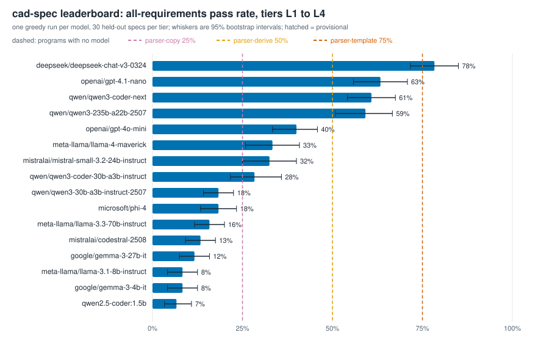
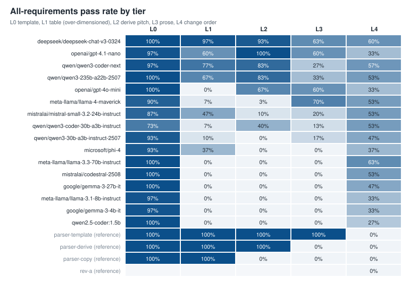
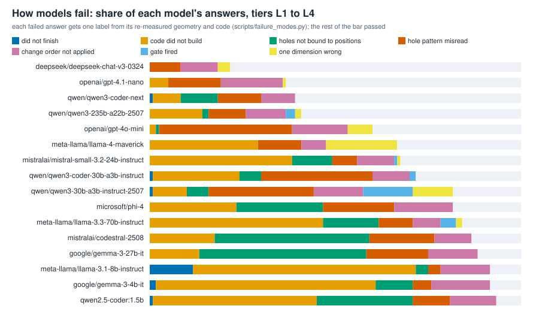

# cad-spec leaderboard

Score: all-requirements pass rate averaged over L1 to L4 (L0 excluded, a regex solves it), one greedy run, 30 held-out specs per tier, 95% bootstrap interval over specs. Ranks inside overlapping intervals are not meaningful.

| # | Model | Score [95% CI] | L0 | L1 | L2 | L3 | L4 | Run cost $ | Most common failure | Notes |
|---:|---|---|---:|---:|---:|---:|---:|---:|---|---|
| 1 | deepseek/deepseek-chat-v3-0324 | 78% [72%, 85%] | 100% | 97% | 93% | 63% | 60% | 0.031 | change not propagated to pitch |  |
| 2 | openai/gpt-4.1-nano | 63% [56%, 71%] | 97% | 60% | 100% | 60% | 33% | 0.014 | change not propagated to pitch |  |
| 3 | qwen/qwen3-coder-next | 61% [54%, 68%] | 97% | 77% | 83% | 27% | 57% | 0.045 | no holes |  |
| 4 | qwen/qwen3-235b-a22b-2507 | 59% [51%, 67%] | 100% | 67% | 83% | 33% | 53% | 0.021 | CadQuery API error |  |
| 5 | openai/gpt-4o-mini | 40% [33%, 46%] | 100% | 0% | 67% | 60% | 33% | 0.021 | margin applied twice |  |
| 6 | meta-llama/llama-4-maverick | 33% [26%, 41%] | 90% | 7% | 3% | 70% | 53% | 0.025 | CadQuery API error |  |
| 7 | mistralai/mistral-small-3.2-24b-instruct | 32% [25%, 40%] | 87% | 47% | 10% | 20% | 53% | 0.008 | CadQuery API error |  |
| 8 | qwen/qwen3-coder-30b-a3b-instruct | 28% [22%, 36%] | 73% | 7% | 40% | 13% | 53% | 0.012 | holes misplaced (other) |  |
| 9 | qwen/qwen3-30b-a3b-instruct-2507 | 18% [14%, 22%] | 93% | 10% | 0% | 17% | 47% | 0.012 | some holes right, some wrong |  |
| 10 | microsoft/phi-4 | 18% [13%, 23%] | 93% | 37% | 0% | 0% | 37% | 0.007 | CadQuery API error | 1 earlier run(s) superseded by reruns |
| 11 | meta-llama/llama-3.3-70b-instruct | 16% [12%, 20%] | 100% | 0% | 0% | 0% | 63% | 0.016 | CadQuery API error |  |
| 12 | mistralai/codestral-2508 | 13% [9%, 18%] | 100% | 0% | 0% | 0% | 53% | 0.033 | holes stacked at one point |  |
| 13 | google/gemma-3-27b-it | 12% [8%, 16%] | 100% | 0% | 0% | 0% | 47% | 0.012 | holes stacked at one point |  |
| 14 | meta-llama/llama-3.1-8b-instruct | 8% [4%, 12%] | 97% | 0% | 0% | 0% | 33% | 0.003 | CadQuery API error |  |
| 15 | google/gemma-3-4b-it | 8% [4%, 12%] | 97% | 0% | 0% | 0% | 33% | 0.005 | CadQuery API error |  |
| 16 | qwen2.5-coder:1.5b | 7% [3%, 11%] | 100% | 0% | 0% | 0% | 27% | 0.000 | CadQuery API error |  |

Reference programs (no model):

| Program | Score | L0 | L1 | L2 | L3 | L4 |
|---|---:|---:|---:|---:|---:|---:|
| reference | 100% | 100% | 100% | 100% | 100% | 100% |
| parser-template | 75% | 100% | 100% | 100% | 100% | 0% |
| parser-derive | 50% | 100% | 100% | 100% | 0% | 0% |
| parser-copy | 25% | 100% | 100% | 0% | 0% | 0% |
| rev-a | n/a |  |  |  |  | 0% |

